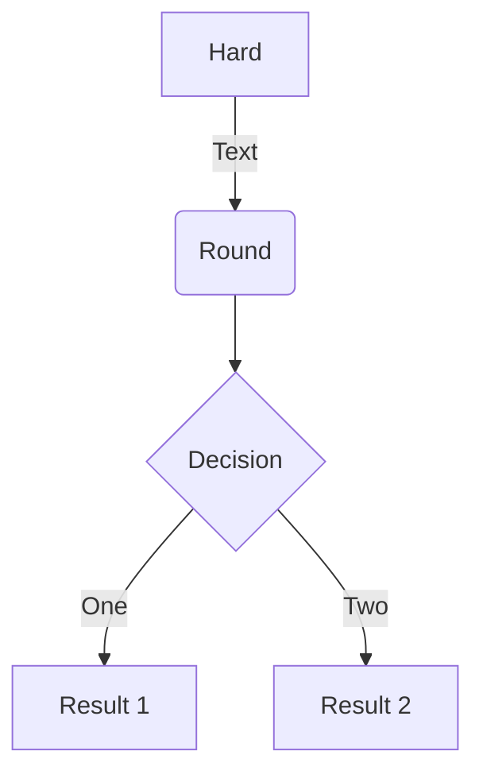
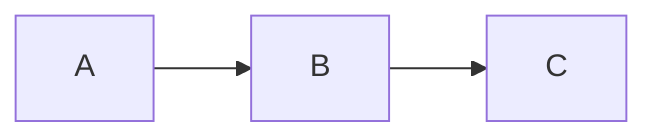

# mermaid test
## Notes
Please make sure your browser support mermaid. Refer to GitHub + Mermaid in the https://github.com/mermaid-js/mermaid/blob/develop/docs/integrations.md , install the follows
- Chrome:  https://chrome.google.com/webstore/detail/github-%20-mermaid/goiiopgdnkogdbjmncgedmgpoajilohe
- Firefox: https://addons.mozilla.org/firefox/addon/github-mermaid/

## Examples
- test mermaid graph

- test mermaid flowchart

